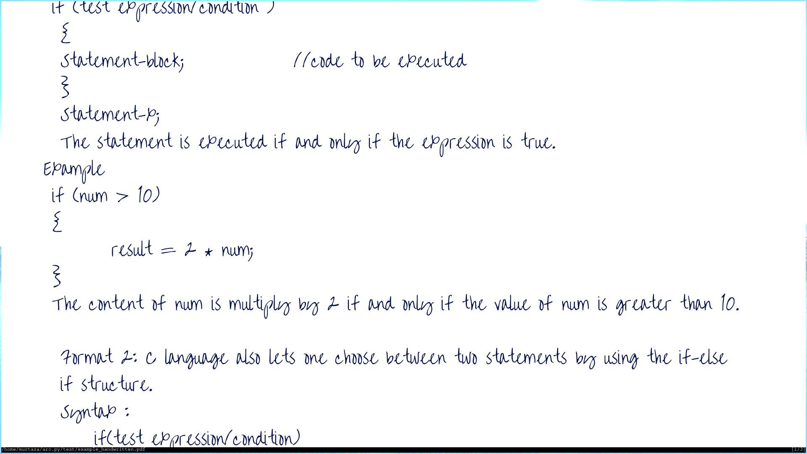

# ARC
> Assignments R Cruel



# A short tale
From the time I got into University I have been burdened with shitload of assignments. Every other day out of nowhere a new assignment pops up. You might think these assignments involve complex computer science problems and impossible math equations. No! Most of the time all I need to do is simply copy down contents of a pdf file(provided by the Professor) on to sheets of paper and send a soft copy to the respective Prof. These assignments provide no substantial growth to the student and are a mere waste of time. My solution -> arc.py

# What is arc.py
arc.py is a simple python script that takes a pdf file as an input and generates a pdf file that looks like it was hand written.

# Install
```bash
git clone https://github.com/Murtaza-Udaipurwala/arc.py
cd arc.py/
pip install -r requirements.txt
```

# Usage
```bash
python arc.py <path/to/input.pdf>
```

# Example
Check [example](https://github.com/Murtaza-Udaipurwala/arc.py/tree/master/test)

# PS
> I hope my Professor doesn't find this
